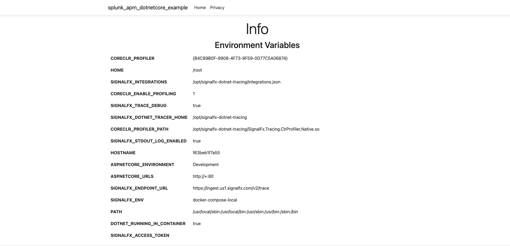
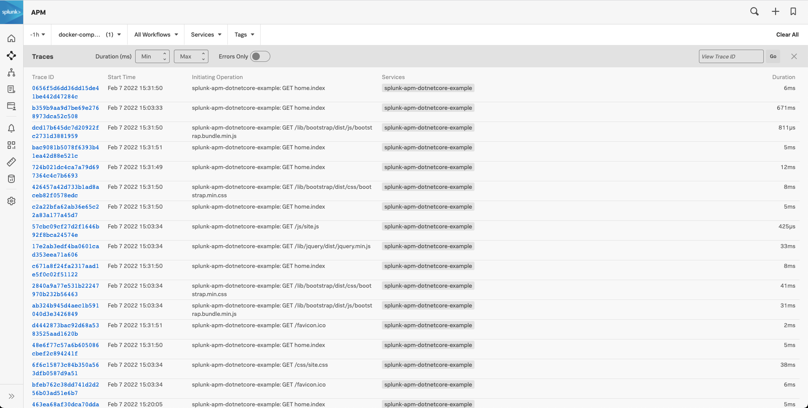

# Splunk APM .NET Core Example

An example app for demonstrating how to instrument an ASP.NET Core application to send traces to Splunk APM.
The application is a simple MVC application that prints the environment variables to the home app of the app.
The application runs in a container and the container image embeds the APM tracer [directly](./Dockerfile#L21).

## Getting Started

Follow these steps from this project's root directory.


### Running with Docker Compose

The simplest way to test this out is to run it with [Docker Compose](https://docs.docker.com/compose/install/).
The [docker-compose.yml](./docker-compose.yml) file is set up so that trace data is sent directly to Splunk APM. 

To test this, first build the application image with Compose:

```shell
$ docker-compose build 
```

This creates a Docker image called `splunkapmdotnetcoreexample` which is used in the [docker-compose.yml](./docker-compose.yml) file.

Next, before running the application, set the following environment variables with the values from your Splunk APM environment:

```shell
$ export SPLUNK_TOKEN=<your_token>
$ export SPLUNK_REALM=<your realm, e.g. us1>
```

Then you can run the application with:

```shell
$ docker-compose up
```

You should be able to browse to the app at http://localhost:8888, which displays the environment variables:



Navigate the app and refresh  pages a few times. You should start to see debug lines similar to the following in your app's terminal:

```shell
splunk-apm-dotnetcore-example-splunk-apm-dotnetcore-example-1  | [DBG] Span started: [s_id: 11072996535285499062, p_id: null, t_id: a6bc0a20e152e9537ba5d3176ad48b49]
splunk-apm-dotnetcore-example-splunk-apm-dotnetcore-example-1  |
splunk-apm-dotnetcore-example-splunk-apm-dotnetcore-example-1  | [DBG] Span closed: [s_id: 11072996535285499062, p_id: null, t_id: a6bc0a20e152e9537ba5d3176ad48b49] for (Service: splunk-apm-dotnetcore-example, Resource: /home/privacy, Operation: home.privacy, Tags: [environment,signalfx.tracing.library,signalfx.tracing.version,component,span.kind,http.method,http.request.headers.host,http.url,aspnet.controller,aspnet.action,http.status_code])
splunk-apm-dotnetcore-example-splunk-apm-dotnetcore-example-1  |
splunk-apm-dotnetcore-example-splunk-apm-dotnetcore-example-1  | [DBG] Span started: [s_id: 12392792930600762230, p_id: null, t_id: 6e6a2c8f5f8489f98421f4d910a978a8]
splunk-apm-dotnetcore-example-splunk-apm-dotnetcore-example-1  |
splunk-apm-dotnetcore-example-splunk-apm-dotnetcore-example-1  | [DBG] Span closed: [s_id: 12392792930600762230, p_id: null, t_id: 6e6a2c8f5f8489f98421f4d910a978a8] for (Service: splunk-apm-dotnetcore-example, Resource: /home/privacy, Operation: home.privacy, Tags: [environment,signalfx.tracing.library,signalfx.tracing.version,component,span.kind,http.method,http.request.headers.host,http.url,aspnet.controller,aspnet.action,http.status_code])
splunk-apm-dotnetcore-example-splunk-apm-dotnetcore-example-1  |
splunk-apm-dotnetcore-example-splunk-apm-dotnetcore-example-1  | [DBG] Span started: [s_id: 13120475306993710256, p_id: null, t_id: 78f4b4b0e67b192981ca0a9d34a91a4b]
splunk-apm-dotnetcore-example-splunk-apm-dotnetcore-example-1  |
splunk-apm-dotnetcore-example-splunk-apm-dotnetcore-example-1  | [DBG] Span closed: [s_id: 13120475306993710256, p_id: null, t_id: 78f4b4b0e67b192981ca0a9d34a91a4b] for (Service: splunk-apm-dotnetcore-example, Resource: /, Operation: home.index, Tags: [environment,signalfx.tracing.library,signalfx.tracing.version,component,span.kind,http.method,http.request.headers.host,http.url,aspnet.controller,aspnet.action,http.status_code])
```

This means the application is instrumented properly and is sending out trace spans.

If the environment variables that you set up previously are correct, after a few minutes, you should see the application's traces in Splunk APM:



#### Sending the data to OpenTelemetry Collector

Instead of sending the trace data directly to Splunk APM, you may decide to send the trace data to an OpenTelemetry Collector instead.
If so, you can change the environment variable `SIGNALFX_ENDPOINT_URL` in the [docker-compose.yml](./docker-compose.yml) file to point to your
collector's endpoint:

```
SIGNALFX_ENDPOINT_URL=http://<OTEL_COLLECTOR_ADDRESS>:9411/api/v2/spans

```


### Running in Kubernetes
This example can also be run in Kubernetes.This assumes that you've installed the Splunk OpenTelemetry Collector in your cluster.
If you haven't installed that yet, follow these [instructions](https://docs.splunk.com/Observability/gdi/opentelemetry/install-k8s.html) first.


The [kubernetes](./kubernetes) directory in this project contains manifest files for deploying this to Kubernetes.

In the [deployment.yaml](./kubernetes/deployment.yaml) file, the image tag used is `bxtp4p/splunkapmdotnetcoreexample`.
To deploy this to Kubernetes using this image, run the following:

```shell
$ cat kubernetes/*.yaml | kubectl apply -f -
```

To access the application:

```shell
$ kubectl port-forward service/aspnet-mvc-dotnetcore-example 8000:80
```

You should now be able to browse the app at http://localhost:8000. Browse the site and refresh the page a few times.
After a few minutes, your application should show up in Splunk APM (listed under the `dev` environment).